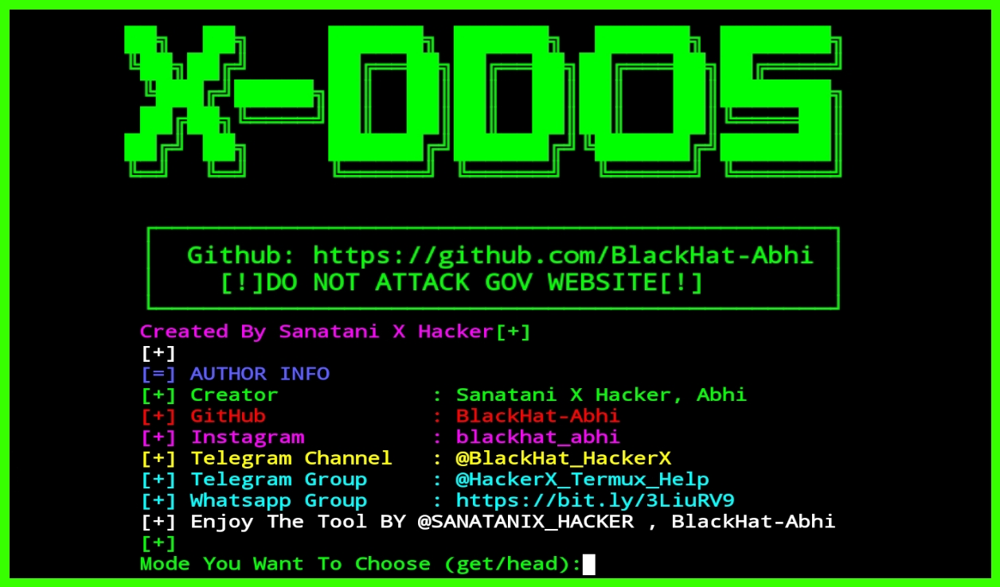

# X-DDOS

X-DDOS is A Power Full Ddos Atteck tool

    Warning: for educational purposes only DO NOT ATTACK GOV WEBSITE
    [!]This is a dender attack any miss use your risk[!]
    
    
   # INSTALLATION COMMANDS

`apt update && apt upgrade `
`apt install python3`
`apt install pip`
`apt install git`
`pip3 install requests pysocks`
`git clone https://github.com/BlackHat-Abhi/X-DDOS.git`
`  ls`
`cd X-DDOS`
`  ls`
`python3 X-DDOS.py`

 
# Screen Shot 

# X-DDOS

DDoS attacks on your Internet properties, depending on your plan and services. You can choose from different delivery methods. Each notification email includes the following information: Description

Can you Ddos with proxies? The number of DDOS attacks using anonymous proxies has increased. The number of distributed denial of service attacks using anonymous proxies has increased dramatically over the past year, according to a new research report, as attackers use these proxies to create an instant pseudo-botnet

DDoS Attack means "Distributed Denial-of-Service (DDoS) Attack" and it is a cybercrime in which the attacker floods a server with internet traffic to prevent users from accessing connected online services and sites.

This section explains your rights to use the Service, and the conditions ... It also explains that there are some things we will not be responsible for !!

### Telegram Channel : [Channel](https://t.me/BlackHat_HackerX)

## CONNECT WITH US :

